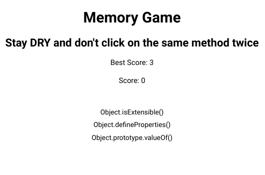

<h1 align="center">Memory Card</h1>

   Solution for a challenge from  <a href="https://www.theodinproject.com/paths/full-stack-javascript/courses/javascript/lessons/memory-card" target="_blank">theodinproject.com</a>.

## Table of Contents

- [Overview](#overview)
  - [Built With](#built-with)
  - [Thoughts](#thoughts)
- [Features](#features)
- [Improvements](#improvements)
- [Useful Resources](#useful-resources)

## Overview

[Live Link](https://jdegand.github.io/odin-project-memory-card)

### Built With

- React

### Thoughts

- I didn't use images because I didn't want to download and compress many images.  
- Obviously, I could have used an api but many apis don't have fields that have links to images.
- I used an array of function names instead and I played off the DRY ethos.  
- In the game's logic, you add the target of a click to an array and then check the array for the added value.  
- If the added value is already in the array, the game is over. Else you +1 to the score.
 
## Features

The [challenge](https://www.theodinproject.com/paths/full-stack-javascript/courses/javascript/lessons/memory-card) was to build a memory game in React.  The memory game ends when you select something you had selected prior.  

## Improvements

- Styling
- Accessibility
- Local Storage for high scores
- Add cursor for choices or highlighting

### Useful Resources

- [Wikipedia](https://en.wikipedia.org/wiki/Don%27t_repeat_yourself) - Dont repeat yourself
- [MDN Docs](https://developer.mozilla.org/en-US/docs/Web/JavaScript/Reference/Global_Objects/Object) - Object and its methods
